# SkillSwap

SkillSwap is a responsive web application designed to connect people based on the skills they want to teach and learn. Built with **Next.js**, **Tailwind CSS**, and **shadcn/ui**, it supports both dark and light modes for an enhanced user experience.

## Author

- Nguyen Thi Ngoc Anh
- Nguyen Nhu Ha
- Nguyen Pham Anh Thu
- Nguyen Thi Cam Thach
- Le Thi Diem My
- Le Phuong Uyen Nhi

## Getting Started

To start the development server, run:

```bash
npm run dev
# or
yarn dev
# or
pnpm dev
# or
bun dev
```

Then, open [http://localhost:3000](http://localhost:3000) in your browser to view the app.

## Project Goal

SkillSwap enables users to showcase a skill they can teach and one they want to learn. It facilitates mutual skill exchange by connecting users with shared interests.

---

## Tech Stack

- **Framework**: [Next.js](https://nextjs.org/)
- **Styling**: [Tailwind CSS](https://tailwindcss.com/)
- **UI Components**: [shadcn/ui](https://ui.shadcn.com/)
- **State Management**: `React Context API` via `useContext`
- **Mock Backend**: Local JSON file
- **Storage**: `localStorage` for session persistence

---

## Test Accounts

Use the following usernames to log in:

1. `alexj`
2. `bella.design`

---

## Pages Overview

### Landing Page

- Public welcome page with a call-to-action for login/signup.

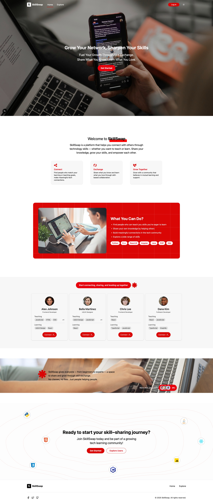
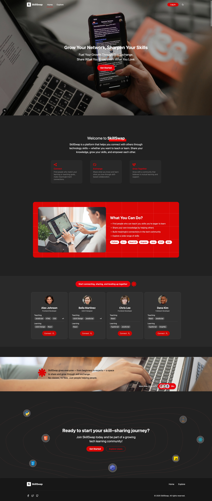

### Login Page

- Enter a test account username.
- Saves the current user to `localStorage` for session persistence.

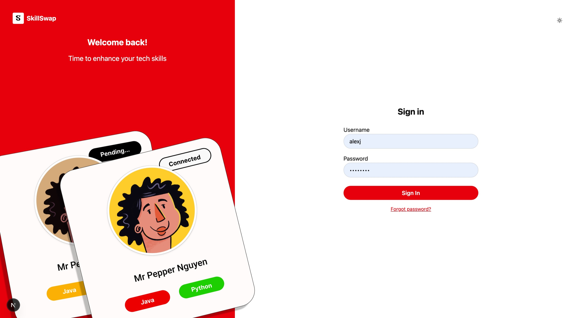
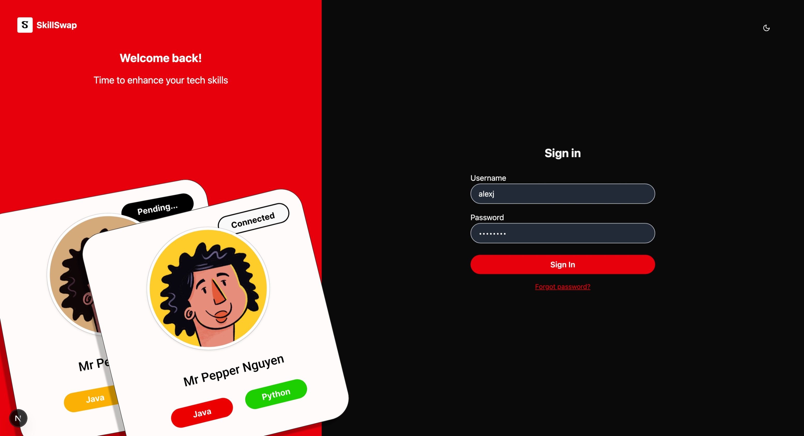

### Explore Page

- **Features**:
  - Users sorted by match status and number of compatible skills.
  - Highlight users with at least one match in both "teach" and "learn".
- **Filters**:
  - By skill to teach or learn.
  - By username or name (search).
- **Actions**:
  - Send connection requests.
  - Accept/reject invitations.
  - Cancel sent requests.

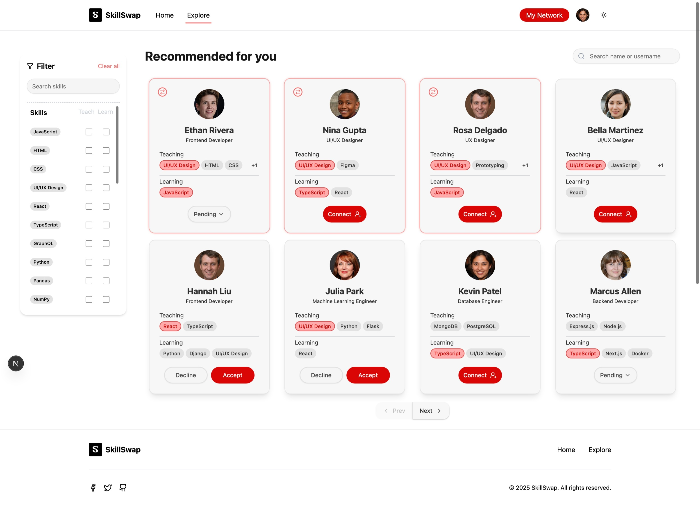
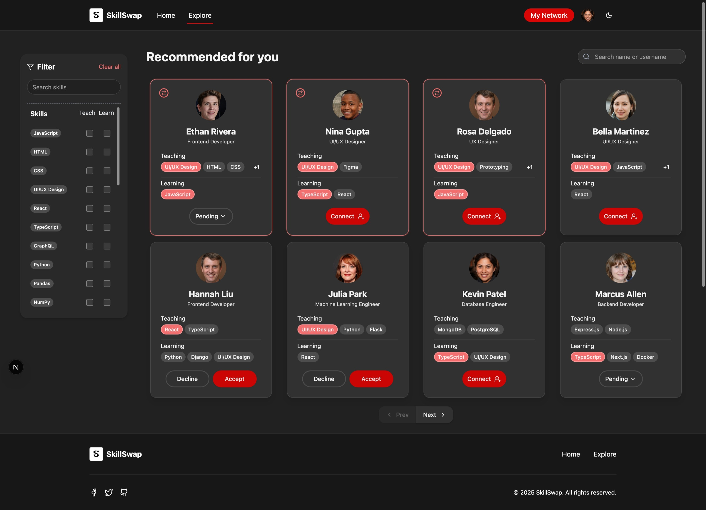

### My Network Page

- Displays connections categorized as:
  - My Connections
  - Pending Requests (sent)
  - Invitations (received)
- Supports filters and search.

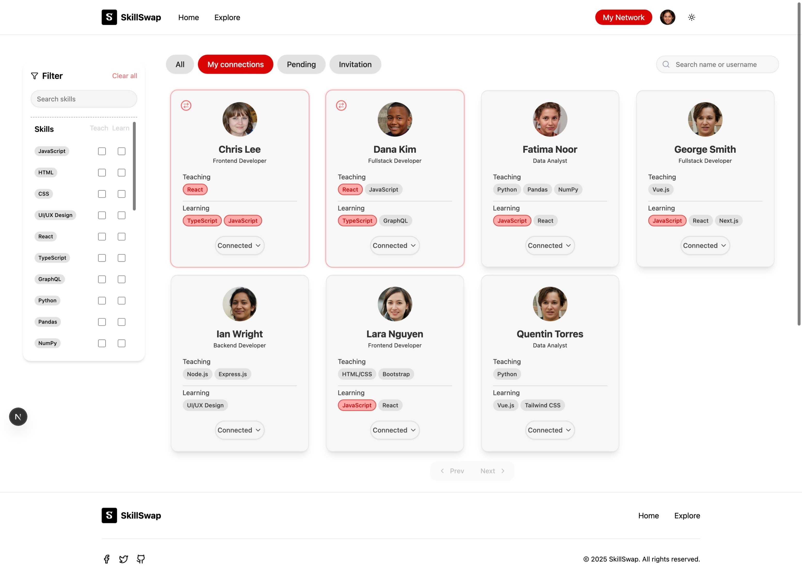
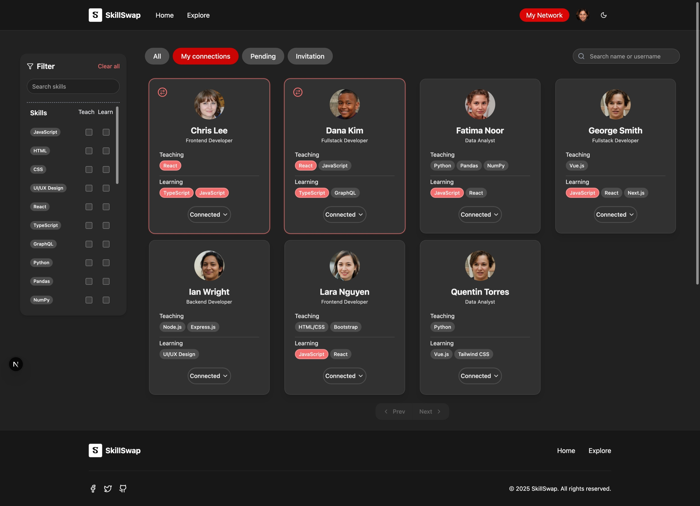

### Settings Page

- Allows users to edit:
  - Name
  - Date of birth
  - Bio
  - Skills to Teach
  - Skills to Learn

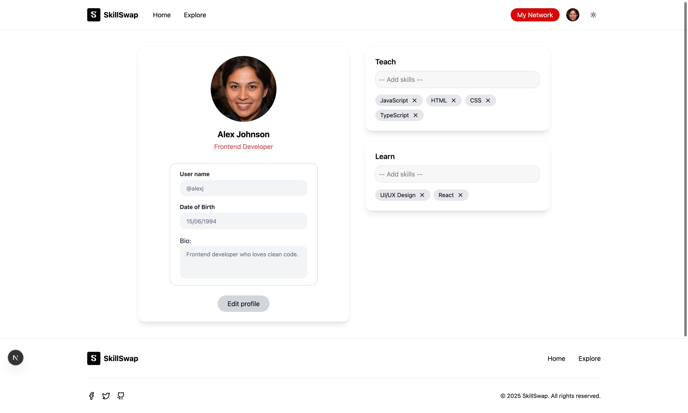
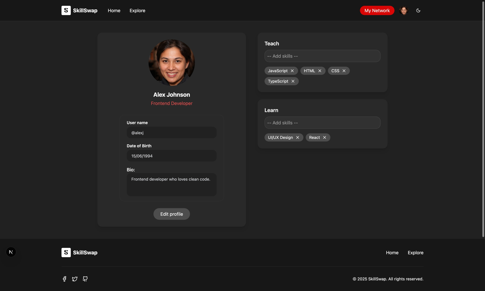

### User Profile Page

- View another user’s full profile.
- Displays mutual skills.
- Includes an action button (connect / pending / connected / respond).

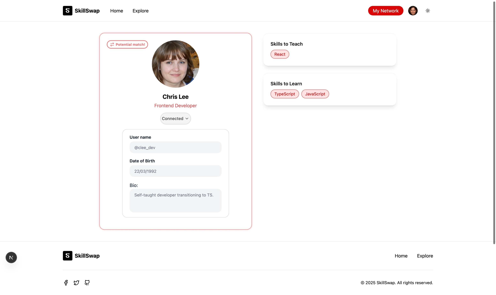
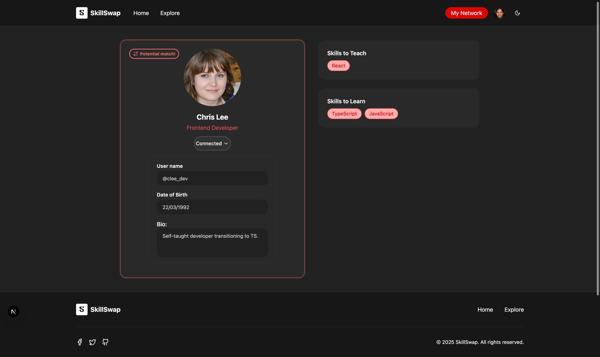

---

## Features

- **Responsive Design**: Optimized for both desktop and mobile devices.
- **Dark/Light Mode**: Seamless theme switching.
- **Skill Matching**: Intuitive logic to connect users with shared interests.
- **Persistent Sessions**: User data stored in `localStorage`.
