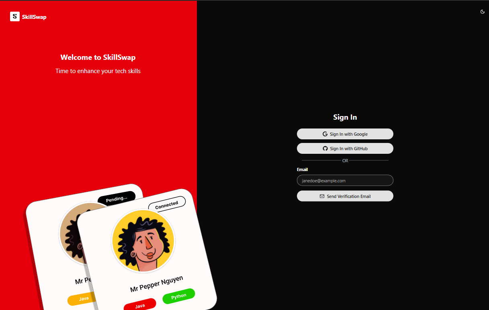
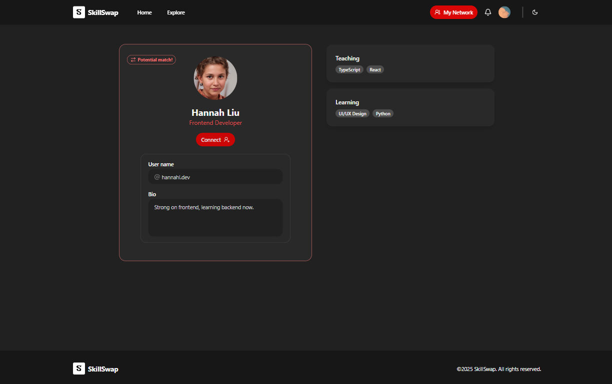

# SkillSwap

SkillSwap is a responsive web application designed to connect people based on the skills they want to teach and learn.

Built with **Next.js** (JavaScript), **Auth.js**, **MongoDB**, **Socket.IO**, **Cloudinary** (image storage), **Tailwind CSS**, and **shadcn/ui**, it supports both dark and light modes for an enhanced user experience.

### Preview

<div>
    
    
</div>

<div>
    
    
</div>

<div>
    
    
</div>

## Author

- Nguyen Thi Ngoc Anh
- Nguyen Nhu Ha
- Nguyen Pham Anh Thu
- Nguyen Thi Cam Thach
- Le Thi Diem My
- Le Phuong Uyen Nhi

## Getting Started

To start the development server, run:

```bash
npm run dev
# or
yarn dev
# or
pnpm dev
# or
bun dev
```

Then, open [http://localhost:3000](http://localhost:3000) in your browser to view the app.

## Project Goal

SkillSwap enables users to showcase a skill they can teach and one they want to learn. It facilitates mutual skill exchange by connecting users with shared interests.


## Tech Stack

- **Framework**: [Next.js](https://nextjs.org/), [Auth.js](https://authjs.dev/)
- **Database**: [MongoDB](https://www.mongodb.com/)
- **WebSocket**: [Socket.IO](https://socket.io/)
- **Image Storage**: [Cloudinary](https://cloudinary.com/)
- **Styling**: [Tailwind CSS](https://tailwindcss.com/) and  [shadcn/ui](https://ui.shadcn.com/)